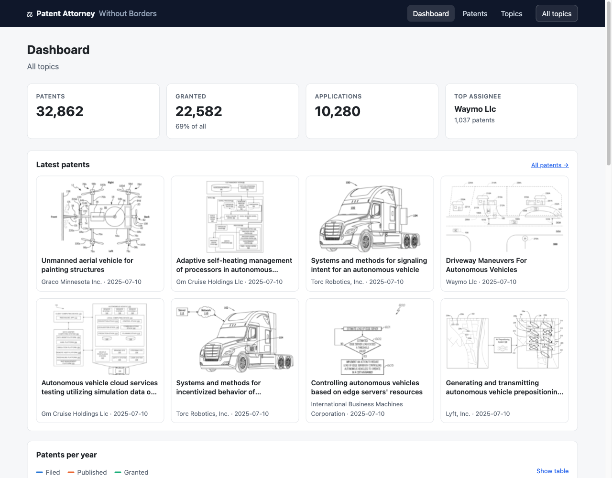

# Patent Attorney Without Borders

A dashboard of US patents by technology topic — drones, autonomous driving and cybersecurity to start with, and any topic you describe by keywords — with the representative figure of each patent: who files, how much, from where, since when, and what the inventions look like. Select several topics that describe an idea and the patents matching most of them come first: a first look for prior art. `docker compose up` starts it with the data in place, and it collects new topics and refreshes itself when the public patent data changes.

> Originally built for the **KPMG Ideation Challenge 2020** by team **Jackpop** — leader [gunh0](https://github.com/gunh0), crew Ji-hun Lim, Seung-jae Lee and Min-soo Kim. The idea: a "borderless patent attorney" that helps inventors and companies see who already holds patents around their idea before they file. See [History](#history) for how it got here.



## Features

- **Topics you define**: add, edit or delete topics on the Topics page with a name and keywords (words or phrases, matched as whole words in titles and abstracts, plurals included). A new topic shows the stored patents it matches at once, then grows while it is collected from the public data, with its progress on the page.
- **Several topics at once**: select them in the header, and the patent list ranks patents by how many of the topics they match ("3 of 3" first), or keeps only those matching all.
- **Dashboard** for the selection: patents, grants and applications, the latest patents as cards with their figures, filings / publications / grants per year, the topics' publications per year side by side, assignee countries (a click narrows the dashboard to one country's assignees), the most cited patents, top assignees with their grant rate, top inventors. Charts can be shown as tables.
- **Representative figures** from Google Patents in the dashboard, the patent list and the details; a figure or card opens the patent on Google Patents.
- **Patent list** with full-text search (titles, abstracts, names), filters for assignee (with suggestions), inventor, assignee country, grant status and publication years, sortable columns including citations, 25–100 rows per page. Filters and the open patent live in the URL, so every view can be shared.
- **Details panel** with the abstract, topics, assignee country, dates, the number of applications citing the patent and its representative figure.
- **Assignee and inventor pages**: activity per year, grant rate, latest publications, co-inventors — every name in the app links to its page.
- **CSV export** of any filtered list, in the column layout of Google Patents' own download.
- Dark mode, small screens, printing and keyboard use (`/` jumps to the search). OpenAPI description of the REST API at `/api/schema/`.

## Quick start

```bash
docker compose up -d --build     # or: make up
open http://localhost:8080
```

The first start loads the bundled snapshot of the three default topics, so the dashboard is complete right away. A `collector` service collects topics added or edited in the dashboard, and all topics again when the public data has a new revision (checked daily). Set `PATENTS_ALLOW_TOPIC_EDITS=0` for an instance others can reach: the API has no accounts.

## Data

| | |
|---|---|
| Patents | [Google Patents Public Data](https://console.cloud.google.com/marketplace/product/google_patents_public_datasets/google-patents-public-data) (BigQuery table `patents.publications`, CC BY 4.0), read without an account from its [Parquet copy on Hugging Face](https://huggingface.co/datasets/labofsahil/patents-publications-dataset) with DuckDB |
| Scope | US publications since 2015 whose title or abstract matches a topic's keywords; an application and its grant become one patent, stored once for all the topics it matches |
| Citations | counted by reading the citations of all publications: how many applications cite each patent |
| Countries | of the first assignee, as harmonised by Google |
| Figures | Looked up on each patent's Google Patents page — pages of single patents are open to crawlers, the search is not — the first time the patent is shown, then stored |
| Snapshot | [`backend/patents/seed/`](backend/patents/seed), refreshed with `make -C backend collect seed` |

Collecting reads the titles, abstracts and citations of 56 Parquet files — about 90 GB of the 1 TB dataset, as only the needed columns are fetched — in one pass for all topics that wait. That takes one to two hours on a laptop and a few in a small container, so a new topic first shows the stored patents it matches. DuckDB uses as many threads as the memory allows (about 100 MB each).

## Development

Requirements: Python 3.13, Node.js 22.

```bash
make install        # backend requirements + frontend packages
make backend        # Django API        http://localhost:8000/api/
make frontend       # React dev server  http://localhost:3000  (proxies /api)
make test           # backend and frontend tests
make lint           # Django checks, pending migrations, OpenAPI schema, ESLint
make smoke          # build the Docker stack and check it end to end
```

## Architecture

```
browser ──► nginx (frontend container, :8080)
              ├── /            React 19 app (Vite build)
              └── /api, /admin ─► gunicorn + Django 5.2 REST API (backend container)
                                      └── SQLite in the backend-data volume
                  collector container ──► Google Patents Public Data (Parquet over HTTPS, DuckDB)
                  backend, on demand  ──► patents.google.com/patent/… for figures
```

| Path | |
|---|---|
| [`backend/`](backend) | Django REST Framework API: topics, patents, stats, figures, export; collection and snapshot commands. [API reference](backend/README.md) |
| [`frontend/`](frontend) | React 19 + Vite: dashboard, patent list, assignee and inventor pages, topics. Charts are plain SVG. |
| [`docker-compose.yml`](docker-compose.yml) | backend, collector and frontend with health checks |
| [`.github/workflows/`](.github/workflows) | CI for both apps and a smoke test of the Docker stack |

### Security notes

- The API only reads; there are no user accounts. The Django admin keeps its own login.
- Patent data comes from a third party: links are only rendered when they are `http(s)`, figures only from Google's patent image host, and exported cells that a spreadsheet would run as a formula are escaped.
- Set `DJANGO_SECRET_KEY` and, behind TLS, `DJANGO_HTTPS=1` for any deployment. All settings are listed in the [backend README](backend/README.md#configuration).
- The containers run as unprivileged users on read-only file systems without Linux capabilities; nginx sends a Content-Security-Policy that only allows the app's own scripts and Google's patent images.

## History

**2020 — challenge prototype.** A Selenium script opened Google Patents for a keyword and clicked the CSV download; a Django app stored the rows and a React admin template (Shards Dashboard) displayed them.


**2022 — rewrite.** Automating the Google Patents UI broke whenever the page changed and is not how the site is meant to be used, so the rebuilt app imported the CSV that users downloaded themselves. Backend and frontend were rewritten from scratch with tests, CI and Docker; the Selenium script, the bundled chromedriver binaries and both React templates were removed.

**2025 — upgrade.** Django 5.2 LTS on Python 3.13, React 19 with Vite 7 on Node.js 22, hardened containers, assignee and inventor pages.

**2026 — automatic data.** Downloading exports by hand kept the dashboard empty until someone did it. The app now collects its topics from Google Patents Public Data on its own, ships a snapshot so it starts complete, and shows the representative figures again, as the 2020 prototype did. The CSV import was removed. Since 3.0, topics are defined in the dashboard, matched in abstracts too and combined to rank patents, closer to the original idea of checking what exists before filing.

## License

[Apache License 2.0](LICENSE)
